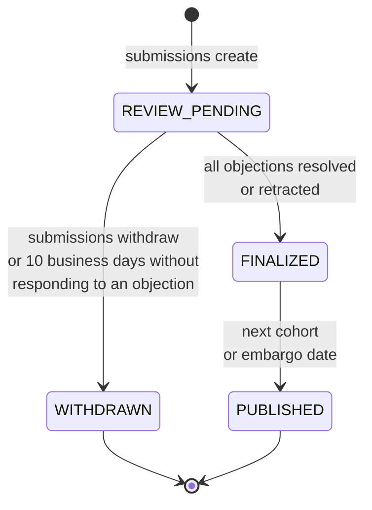

# Submission states

The status values a submission carries, and what moves it between them.

## States

| Status | Set by | Meaning |
|---|---|---|
| `REVIEW_PENDING` | `submissions create` | Submission created and bundle uploaded; awaiting review |
| `WITHDRAWN` | `submissions withdraw` | Retracted; bundle deleted |
| `FINALIZED` | Review workflow (server-side) | Review complete; submission accepted |
| `PUBLISHED` | Review workflow (server-side) | Results published in the MLPerf leaderboard |

Only the first two are set by the CLI. The others are set server-side by the review workflow.



!!! question "This list may be incomplete"
    These four are the states documented by the CLI. Whether the review workflow reports additional
    states — rejected at Week 0, in dispute, invalidated, embargoed — is not documented in any
    source. Tracked as **C5** in [Open questions](../help/open-questions.md).

## Review phases

Status is coarse; the review phase is what actually governs your obligations.

| Phase | Window | Status during |
|---|---|---|
| Automated compliance | Week 0 | `REVIEW_PENDING` |
| Peer review | Weeks 1–3 | `REVIEW_PENDING` |
| Objection resolution | Weeks 4–6 | `REVIEW_PENDING` |
| Dispute resolution | From Week 6, ~5 weeks | `REVIEW_PENDING` — does not finalize until the dispute concludes |
| Finalized | — | `FINALIZED` |
| Published | Next cohort, or the embargo date | `PUBLISHED` |

What happens in each phase: [§6.5 of the Submission Rules][srules-6.5]. Under provisional
publication the clock starts differently, and an embargo delays review too ([§6.2.3][srules-6.2.3]).

See [How submission works](../understand/how-submission-works.md) and [After you
submit](../workflow/after-submission.md).

## Tags a published result can carry

Distinct from status. A result can carry:

| Tag | Meaning |
|---|---|
| **peer review pending** | Provisionally published before review completed. Removed at finalization |
| **Preview — Available by [date]** | Preview publication status, with its 180-day deadline |
| **MLC Estimated Power** | Some or all of the power figures behind `system_tps_per_kw` were filled in by MLCommons |
| **Invalidated** | Removed from the active results page, retained in the historical archive with a description of the error |
| **Withdrawn** | Post-finalization withdrawal — removed from active results, retained in the archive |

Where each is defined: *peer review pending* in [§6.2.3][srules-6.2.3], *Preview* in
[§7.3][srules-7.3], *Invalidated* in [§8.1][srules-8.1] and *Withdrawn* in [§8.2][srules-8.2] of the
Submission Rules; *MLC Estimated Power* in [rules §4.5.2][rules-4.5.2].

!!! note "Pre-finalization withdrawal leaves no record"
    Withdrawing before finalization leaves nothing in the archive; withdrawing after leaves a
    *Withdrawn* entry ([§8.2 of the Submission Rules][srules-8.2]).

## Where the publication status categories fit

`Available`, `Preview` and `RDI` are **publication status**, not submission state. A submission has
one of each. See [Publication status](../rules/publication-status.md).

## Result IDs

```
<major>.<minor>.<cohort>.<model_id>.<dataset_id>.<entry>
```

Assigned by MLCommons at publication and never reused. It is not the submission ID the CLI shows
you. Format, components and how it differs from the submission ID: [rules §8.5][rules-8.5].

## Historical record

MLCommons keeps every version of every Pareto curve, aligned to cohorts: [Versioning and Historical
Record][srules-versioning-and-historical-record] in the Submission Rules.

*Last verified against: `mlcommons/endpoints_policies@v1.0_rules_dev` (6b0b1ef) and
`mlcommons/endpoints-submission-cli@main` (f25f71e), 2026-09-24.*
