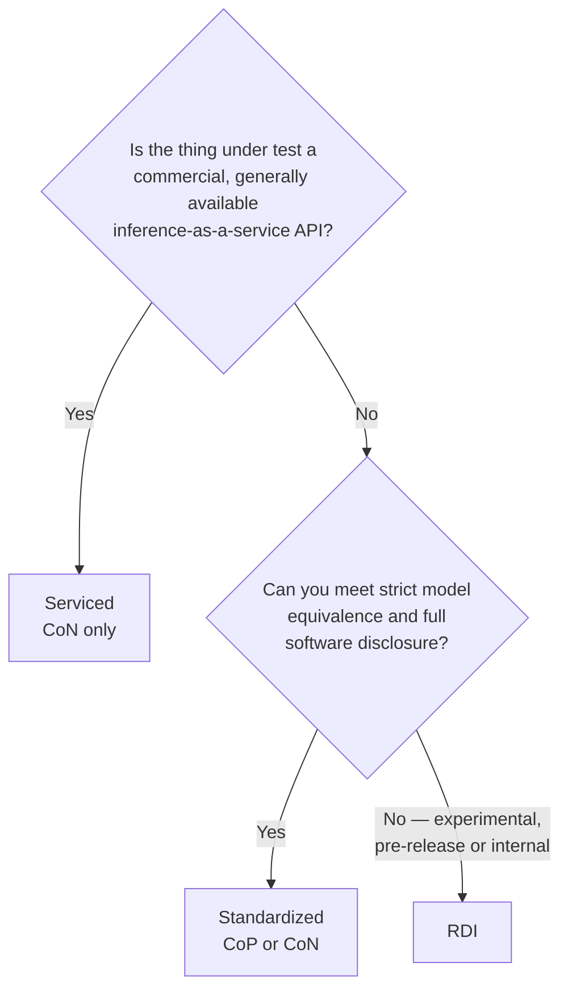

# Divisions and scenarios

You make two choices before running anything, and they determine most of your other obligations:

- **Division** — how much you can change the model, and how much you have to disclose.
- **Scenario** — who runs the client that sends load to your endpoint.

A submission declares exactly **one** division ([§2 of the rules][rules-2]).

!!! note "Division is not the same as publication status"
    Division (Standardized / Serviced / RDI) is about model equivalence and disclosure. Publication
    status (Available / Preview / RDI) is about whether the hardware and software can be bought
    today. They are **independent**, except that the RDI division always carries RDI status. See
    [Publication status](../rules/publication-status.md).

## Choosing a division

The division summary from [§2.5][rules-2.5], with power and naming added:

| Property | Standardized | Serviced | RDI |
|---|---|---|---|
| Transparency | Whitebox | Greybox | Blackbox |
| Scenarios | CoP, CoN *(reported separately)* | CoN only | CoP or CoN *(not separated)* |
| Model equivalence | **Required** | Augmentation allowed, disclosed | Augmentation allowed |
| Code visibility | Full | API-level | None |
| Audit / compliance tests | Yes | Yes (audit + accuracy) | No |
| Fine-tuning / retraining | No | Yes, with disclosure | Yes |
| Must be publicly purchasable | No | **Yes** (GA service) | No |
| Power normalization | **Required** — `system_power.json` per system | Not yet defined | Optional |
| Result name | "MLPerf Endpoints" | "MLPerf Endpoints Serviced" | "MLPerf Endpoints RDI" |

### Standardized

The main division, equivalent to *Closed* in MLPerf Inference: strict model equivalence and full
disclosure ([§2.2][rules-2.2]). Optimisation rules are a **disallowed list**, so anything not banned
is allowed. Read [Model equivalence](../rules/model-equivalence.md) in full before you start tuning.
Your serving stack has to meet the **Available** definition but doesn't have to be open source.

Standardized results are also normalised by provisioned power, in both CoP and CoN. That means
gathering public power ratings for your CPUs, accelerators and switches before you submit. See
[Power normalization](../rules/requirements.md#power-normalization).

### Serviced

For benchmarking commercial Gen AI APIs that anyone can buy; there's no MLPerf Inference equivalent.
The requirements are about the *service*, not the hardware: general access, disclosure of model,
URL, pricing and rate limits, reproducibility over time, and audit and accuracy tests. You may
modify the model with disclosure, but response caching is not allowed ([§2.3.1][rules-2.3.1]).

!!! danger "The endpoint must be the one your paying customers use"
    No capacity-reserved, dedicated or otherwise privileged endpoint. A submission found to have
    used one is subject to withdrawal **regardless of when it is discovered**, and your terms of
    service must permit third-party benchmarking ([Submission Rules §7.2.5][srules-7.2.5]).

### RDI (Research, Development and Internal)

The role *Open* plays in MLPerf Inference: experimental, pre-release or internal systems, with no
audit, compliance tests or code visibility. You still use the standard datasets, metrics and base
model, and report achieved accuracy ([§2.4.1][rules-2.4.1]).

!!! warning "RDI has a cooling-off period"
    An RDI component can't later be submitted as Available or Preview for at least **221 days**. See
    [Publication status](../rules/publication-status.md).

## Choosing a scenario

From [§2.1.3][rules-2.1.3]:

| | **Client on Prem (CoP)** | **Client over Network (CoN)** |
|---|---|---|
| Client operated by | You | MLCommons |
| Server operated by | You | You |
| Network | Local / data center | Public Internet |
| Network latency in measurements | Yes | Yes |
| Reference client | Yours, unmodified | MLCommons-hosted |

**Client on Prem.** You run the reference client (`inference_endpoint`) unmodified, configured only
through its YAML, and document your network topology ([§2.1.1][rules-2.1.1]).

**Client over Network.** MLCommons runs the client against your public endpoint, and you provide
containers and code to replicate the server elsewhere ([§2.1.2][rules-2.1.2]).

!!! warning "CoN logistics are not published yet"
    The specific MLCommons client locations, network requirements and scheduling procedure for CoN
    submissions are deferred to a separate working-group publication that does not exist yet. If you
    are planning a CoN submission, [ask](../help/support.md) before you schedule anything. Tracked
    in [Open questions](../help/open-questions.md).

For Standardized, CoP and CoN are reported as **separate sub-divisions**. For RDI they are not
separated.

**Next:** [Membership, PRISM and eligibility](eligibility/index.md)

--8<-- "precedence-notice.md"

*Last verified against: `mlcommons/endpoints_policies@v1.0_rules_dev` (6b0b1ef), 2026-09-24.*
