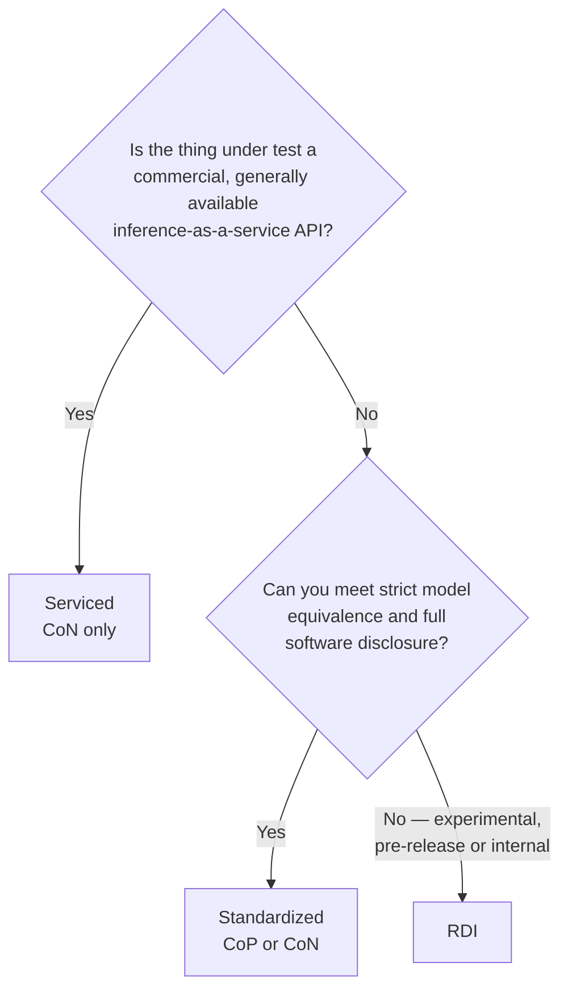

# Divisions and scenarios

You make two choices before running anything, and they determine most of your other obligations:

- **Division** — how much you can change the model, and how much you have to disclose.
- **Scenario** — who runs the client that sends load to your endpoint.

A submission declares exactly **one** division.

!!! note "Division is not the same as publication status"
    Division (Standardized / Serviced / RDI) is about model equivalence and disclosure.
    Publication status (Available / Preview / RDI) is about whether the hardware and software can be
    bought today. They are **independent**, except that the RDI division always carries RDI status.
    See [Publication status](../rules/publication-status.md).

## Choosing a division

| Property | Standardized | Serviced | RDI |
|---|---|---|---|
| Transparency | Whitebox | Greybox | Blackbox |
| Scenarios | CoP, CoN *(reported separately)* | CoN only | CoP or CoN *(not separated)* |
| Model equivalence | **Required** | Augmentation allowed, disclosed | Augmentation allowed |
| Code visibility | Full | API-level | None |
| Audit / compliance tests | Yes | Yes (audit + accuracy) | No |
| Fine-tuning / retraining | No | Yes, with disclosure | Yes |
| Must be publicly purchasable | No | **Yes** (GA service) | No |
| Power normalization | **Required** — `system_power.json` per system | Not yet defined | Optional |
| Result name | "MLPerf Endpoints" | "MLPerf Endpoints Serviced" | "MLPerf Endpoints RDI" |

### Standardized

The main division, equivalent to *Closed* in MLPerf Inference. Strict equivalence to the
reference implementation, full disclosure of weights, configuration, optimisation details and
launch/integration scripts.

Endpoints states its optimisation rules as a **disallowed list**, not an allowed list: anything not
banned, and consistent with model equivalence, is allowed. This is intentional: a fixed list of
approved techniques would need updating every time a new quantization format or kernel appears. Read
[Model equivalence](../rules/model-equivalence.md) in full before you start tuning.

Your serving framework and low-level software stack have to meet the **Available** definition, but
they don't have to be open source.

Standardized results are also normalised by provisioned power, in both CoP and CoN. That means
gathering public power ratings for your CPUs, accelerators and switches before you submit. See
[Power normalization](../rules/requirements.md#power-normalization).

### Serviced

For benchmarking commercial Gen AI APIs that anyone can buy. This division is new in Endpoints and
has no MLPerf Inference equivalent.

The requirements are about the *service*, not the hardware:

- Generally accessible — any customer meeting standard terms can obtain access.
- You must disclose the advertised model name and version, the endpoint URL, the pricing model and
  rates at submission time, and any rate limits or quotas.
- Results must be reproducible when re-benchmarked at a different time within a reasonable window.
- Audit and accuracy tests are required.
- You **may** prune, sparsify, quantize, fine-tune, modify speculative-decoding heads and use
  alternative attention, as long as you disclose it.
- Response caching across queries is **not** allowed.

!!! danger "The endpoint must be the one your paying customers use"
    You can't benchmark a capacity-reserved, dedicated or otherwise privileged endpoint. No
    dedicated cluster stood up for the run, no internal mirror with relaxed rate limits. A
    submission found to have used a non-public or specially provisioned endpoint is subject to
    withdrawal **regardless of when it is discovered**. Your terms of service must also permit
    third-party benchmarking.

### RDI (Research, Development and Internal)

The role *Open* plays in MLPerf Inference: experimental, pre-release or internal systems. No audit,
no compliance tests, no code visibility requirement. You must still use the standard performance
and accuracy datasets, report the same metrics by the same methodology, start from the same base
reference model, and report achieved accuracy.

!!! warning "RDI has a cooling-off period"
    An RDI component may not be submitted as Available or Preview until the later of two cohorts
    after the RDI submission, or **221 days** after first publication as RDI. This exists to stop
    RDI being used to pre-publish on unavailable hardware and then immediately reclassify.

## Choosing a scenario

| | **Client on Prem (CoP)** | **Client over Network (CoN)** |
|---|---|---|
| Client operated by | You | MLCommons |
| Server operated by | You | You |
| Network | Local / data center | Public Internet |
| Network latency in measurements | Yes | Yes |
| Reference client | Yours, unmodified | MLCommons-hosted |

**Client on Prem.** You host both client and server. You have to use the reference client
(`inference_endpoint` from `mlcommons/endpoints`) **without modifying its source**, built from a
commit the review committee can access. Configure it through the YAML config only: anything that
changes how the client behaves has to be expressible there. The client logs its
commit SHA, and review may run a seeded-RNG check against your bound seed set to detect undisclosed
modifications. You must document the network topology: interconnect type, hop count, and measured
baseline latency.

**Client over Network.** MLCommons operates the client and reaches your publicly accessible
endpoint over the Internet. You must provide equivalent containers and code to replicate the server
elsewhere, and the endpoint must conform to the reference API specification.

!!! warning "CoN logistics are not published yet"
    The specific MLCommons client locations, network requirements and scheduling procedure for CoN
    submissions are deferred to a separate working-group publication that does not exist yet. If
    you are planning a CoN submission, [ask](../help/support.md) before you schedule anything.
    Tracked in [Open questions](../help/open-questions.md).

For Standardized, CoP and CoN are reported as **separate sub-divisions**. For RDI they are not
separated.

**Next:** [Membership, PRISM and eligibility](eligibility.md)

--8<-- "precedence-notice.md"

*Last verified against: `mlcommons/endpoints_policies@v1.0_rules_dev` (6b0b1ef), 2026-09-24.*
