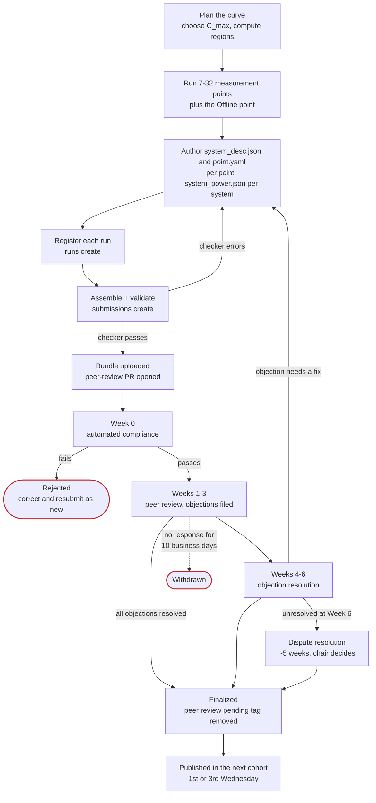

# How submission works

What you do, what MLCommons does, what reviewers do, and when your results become public.

## Overview

## Rolling submission and cohorts

There is no submission deadline. Submit on any day; the submission is timestamped on receipt and
enters the pipeline immediately.

Results publish every two weeks, on the 1st and 3rd Wednesday of each month at 08:00 Pacific.
These batches are called cohorts: `YYYY-MM-C0` for the 1st Wednesday, `YYYY-MM-C1` for the 3rd.

To make a cohort, your submission has to **pass automated compliance at least one business day
before** that Wednesday. If it doesn't, it moves to the next cohort. Review timelines count from the
cohort your submission first appears in, not from the day you uploaded it.

## The review phases

| Phase | Window | What happens |
|---|---|---|
| **Automated compliance** | Week 0 (may finish in a day) | The checker runs server-side. Any failure by end of Week 0 **rejects** the submission — you correct and resubmit as a *new* submission. |
| **Peer review** | Weeks 1–3 | Committee members examine artifacts and file objections as GitHub issues. **No new objections after end of Week 3.** Resolve everything here and you qualify for early finalization. |
| **Objection resolution** | Weeks 4–6 | Carried-over objections must be resolved. Chairs may call a meeting if an objection is 12+ business days old. |
| **Dispute resolution** | From Week 6, ~5 weeks | Automatic escalation for anything still open. Chair issues a binding decision; 8-week backstop. |

### Your response deadline

This is easy to miss. Once someone files an objection against your submission:

- You must post an **initial response within 3 business days**, either acknowledging with a
  resolution schedule, or contesting with evidence. Local public holidays in your primary operating
  jurisdiction do not count against the window.
- The objector then has 2 business days to accept, retract, or carry the objection forward.

If you don't respond, penalties apply automatically. They add up and can't be reversed:

| Business days without your response | Penalty |
|---|---|
| 3 | Finalization delayed by **1 cohort** |
| 6 | Delayed by **2 cohorts** |
| 10 | Submission is **withdrawn** |

Responding later won't undo a penalty you've already triggered, though it does stop things getting
worse. See [After you submit](../workflow/after-submission.md).

## Who reviews you

The review committee for a cohort comes from organisations that have at least one *finalized*
MLPerf Endpoints result in the previous 6 months or 12 cohorts, whichever is longer. Each new
submission also gets one assigned reviewer, picked at random from that pool. Your own organisation
is excluded.

Being a competitor is **not** a conflict of interest. The whole model is built on competitors
reviewing each other. Neither are CSP/OEM/ODM partnerships. Conflicts mean things like direct
financial interest in the outcome or an employment relationship.

## When your results become public

You pick one of three publication modes when you submit, and you **can't change it afterwards**.

| Mode | Public before finalization? | Peer review starts | Finalized result goes public |
|---|---|---|---|
| **Confidential review** *(default)* | No | When automated checks pass | The first cohort after finalization |
| **Confidential review, embargoed** | No | When automated checks pass | On your embargo date |
| **Provisional publication** | Yes, tagged **"peer review pending"** | At provisional publication | The tag is removed at finalization |

**Confidential review, embargoed** is for timing a launch without putting early numbers out. Review
runs as normal and the finalized result is held until your date, which can be up to 60 days after
review completes. If review is still going when the date arrives, the embargo stops mattering and
the result goes out at the first cohort after finalization.

**Provisional publication** gets numbers public before review finishes, for a keynote or press
briefing. You can add an embargo here too, which holds back when the tagged result first appears.
Review only starts once the result is public, so a provisional embargo pushes back your review,
and your finalization, by the same amount of time.

Anyone quoting a "peer review pending" result, whether that's you, MLCommons or the press, has to
include the MLCommons footnote saying results are preliminary and may change. You can move an
embargo date after submitting, but every review committee member is told when you do.

| Group | During review | After finalization |
|---|---|---|
| Review committee | All results, code and artifacts | All |
| Other submitters | All results, code and artifacts | All |
| Public | Nothing, unless you opted in — then tagged results only, no code | Everything |

## After publication

You can't edit published results. If you find an error in a finalized result, the affected points
or the whole submission get invalidated instead. Fixing documentation or metadata is possible, but
needs review-chair approval and publishes with a change log.

Other people can challenge your published result until the **later** of the next audit vote or **90
days** after finalization. After that it's settled. You need to keep the benchmarked system
available for a possible audit until that window closes.

## Audits

MLCommons runs **8 audits a year**, two per quarter:

- **One random.** A submission is drawn at random. Systems equivalent to one audited in the
  previous round (same CPU, NIC, accelerator and accelerator count) are normally excluded.
- **One by vote.** Review committee members nominate submissions in a GitHub issue during the
  **4 weeks after a result is published**, giving a reason such as new hardware or performance
  outside expectations. The chairs can add any system with a new accelerator. The committee then
  picks one by ranked-choice vote. Reproducibility concerns raised after review also go to this
  vote as nominations.

**You have to keep the system as submitted from the moment it's nominated**, not only once it's
picked. If the vote passes you over, that obligation ends. If you're picked, or drawn at random,
it lasts until the audit is complete.

An audit is expected to finish within 60 days. You provide an NDA within 7 days of the auditor
being chosen, and two days of hardware access at a time you both agree: the first for a pre-agreed
list of tests, the second for follow-ups. The burden is on you to show the submission complies.
A submission that fails at a material level is moved to RDI or removed, by committee decision. If
you think being chosen is unfair, you can appeal to the MLCommons Executive Director.

What the auditor actually checks is in the
[MLPerf Endpoints Audit Guidelines](https://github.com/mlcommons/endpoints_policies/blob/v1.0_rules_dev/MLPerf_Endpoints_Audit_Guidelines.md):
that the hardware and software match your system description, that results reproduce, and that
nothing like response caching or benchmark-specific optimisation is going on.

**Next:** [Divisions and scenarios](divisions-and-scenarios.md)

--8<-- "precedence-notice.md"

*Last verified against: `mlcommons/endpoints_policies@v1.0_rules_dev` (6b0b1ef), 2026-09-24.*
