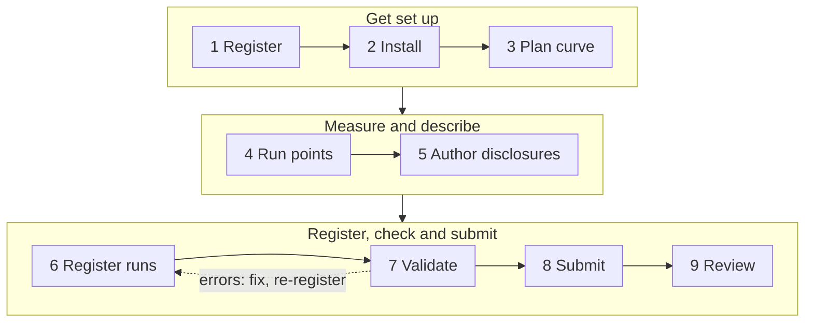

# Submission Workflow

| Step | What it produces |
|---|---|
| [Before you begin](before-you-begin.md) | A decision to proceed, or to stop before it costs anything |
| [1. Register and get a token](register.md) | A [PRISM API key](../understand/eligibility/prism-api-key.md) in `mlc_…` format |
| [2. Install the tools](install-tools.md) | Reference client, submission CLI, checker |
| [3. Plan your Pareto curve](plan-your-curve.md) | The concurrency levels you'll run, and your plan for the Offline point |
| [4. Run the measurement points](run-the-points.md) | One run folder per point, with accuracy results at the required points |
| [5. Author the disclosure files](author-disclosures.md) | `system_desc.json` and `point.yaml` per point, `system_power.json` per system |
| [6. Register your runs](register-runs.md) | One run ID per run folder, uploaded to MLCommons |
| [7. Validate locally](validate.md) | A clean `submission-checker` report |
| [8. Submit](submit.md) | An uploaded bundle and a review PR |
| [9. After you submit](after-submission.md) | A finalized, published result |
